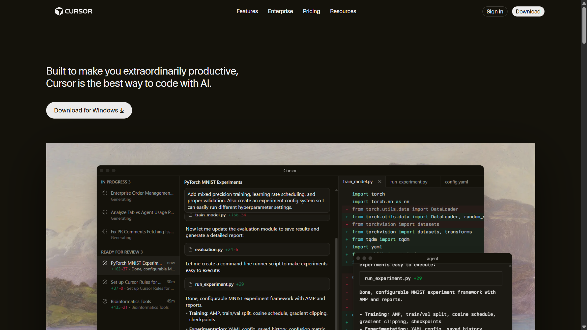
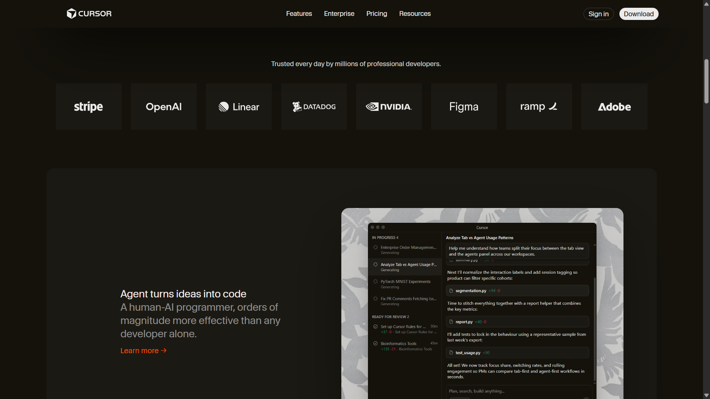
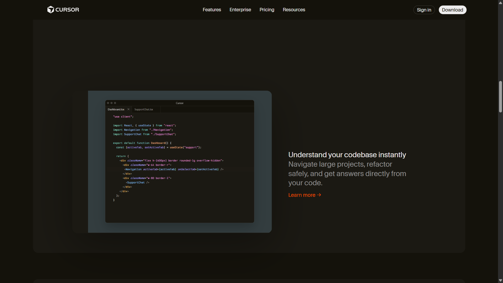
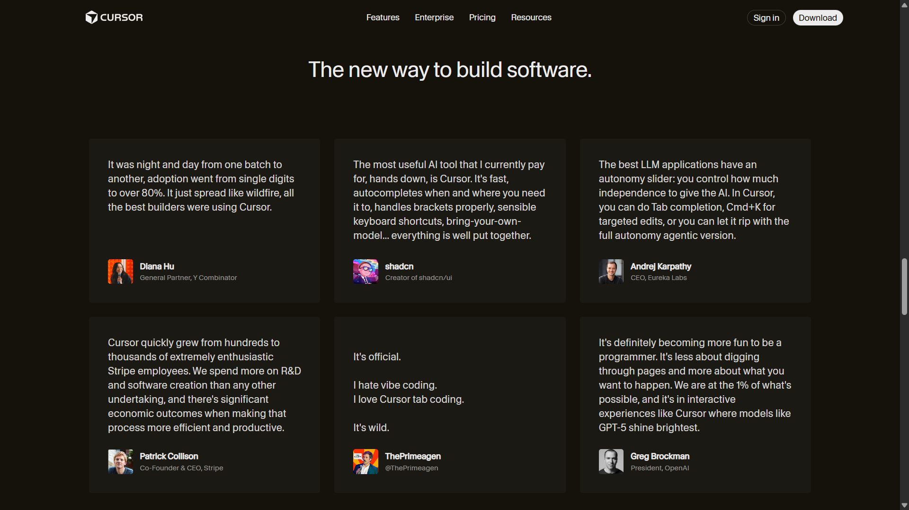
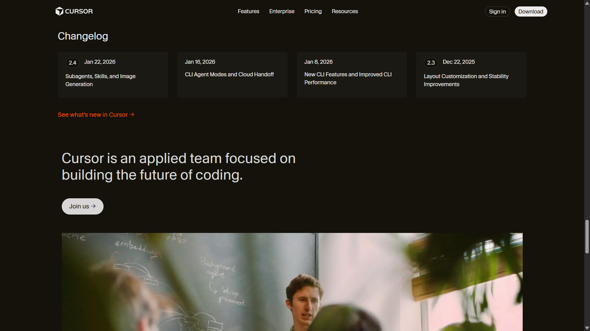
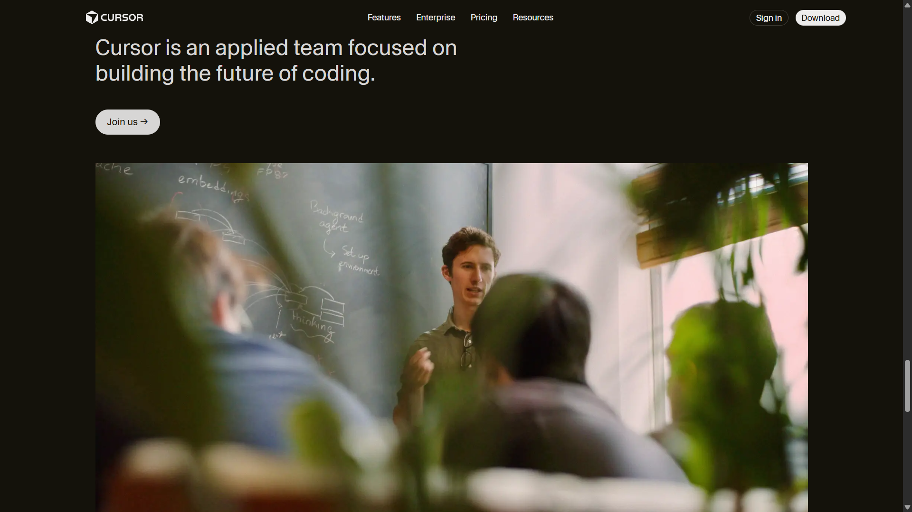
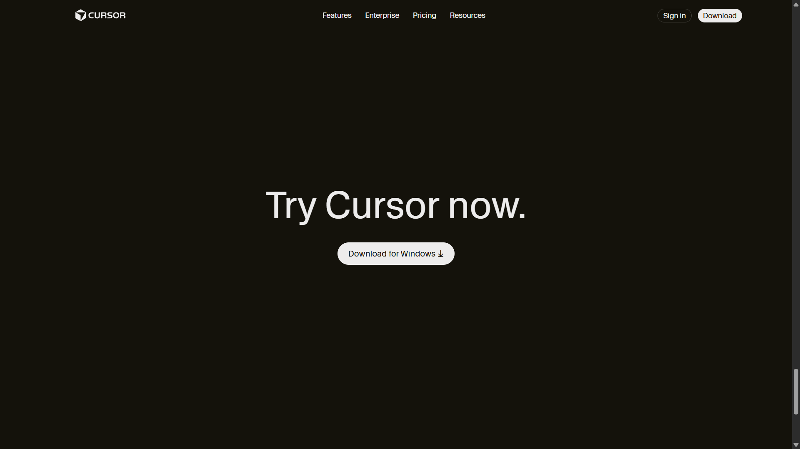
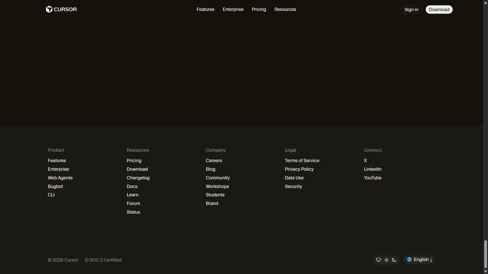

# Cursor Landing Page (HTML & CSS)

This project recreates the Cursor developer tool landing page using only HTML and CSS.
The goal was visual and structural accuracy.

## Live Demo
Check out the live project: [Cursor UI Clone](https://purakh-nath.github.io/cursor-ui-clone/)

## Sections Implemented
- Top Navigation Bar
- Hero Section with CTA
- Editor Preview
- Trusted By Logos
- Feature Sections
- Testimonials
- Feature Cards
- Changelog
- Team / About
- Final Call To Action
- Footer

## Tech Used
- HTML5 (semantic elements)
- CSS3
- No JavaScript
- Desktop-first layout

## Fonts
- CursorGothic
- System font fallbacks

## Color Palette
- Dark background (#14120B)
- Card background (#1B1913)
- Primary text (#EDECEC)
- Accent links (#F54E00)

## Notes
- This is a static UI clone
- No responsiveness or animations were added as per instructions
- Layout spacing and typography closely follow the original Cursor website

## Screenshots

### Home / Hero

### Trusted By Logos

### Feature Cards

### Testimonials

### Frontier

### Changelog

### Team Section

### CTA Section

### Footer
